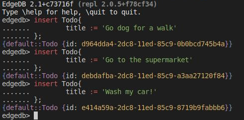
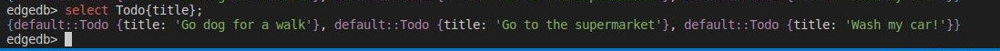
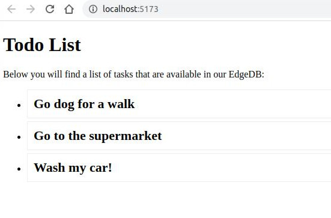

# SvelteKit and EdgeDB Howto

This is a short tutorial on how to quickly scaffold a Svelte app and load data from the EdgeDB

## Prerequisities

Make sure you have install npm and nodejs

## Creating the structure of the project

Lets say that we want to create a web app named as 'my-app'.

```bash
# create a new project in my-app
# when asked select 'Skelton app' and Javascript.
npm create svelte@latest my-app


# go inside the folder
cd my-app

# install node modules
npm install
npm install edgedb
```

## Initialize the EdgeDB instance and Create the database schema

```bash
# go inside the folder
cd my-app

# initialize a new project
# when asked select 'Y' (yes)
# leave the otheroptions as default
edgedb project init
```

Now lets create the database schema!

We want to create a simple structure with just a 'title' field to hold our todo list of tasks.

So open the file /dbschema/default.esdl and paste this inside:

```sql
module default {
	type Todo{
		required property title -> str;
	}
}
```
Now lets migrate!

```bash
# create the migration
edgedb migration create

# and migrate
edgedb migrate
```

## Seeding

So far we have create the database schema but with no data inside so lets add the following three Tasks:

* Go dog for a walk
* Go to the supermarket
* Wash my car!

```bash
# open the CLI
edgedb
```

and paste these into it:

```sql
insert Todo{
	title := 'Go dog for a walk'
};

insert Todo{
	title := 'Go to the supermarket'
};

insert Todo{
	title := 'Wash my car!'
};
```

This is what you should see in your console:



If you run this:
```bash
# open the CLI
edgedb> select Todo{title};
```
You should get something like this:



## Lets display the Data!

Create a file name '+page.server.js' inside the folder 'src/routes' and paste this content inside it:

```javascript
import { error } from '@sveltejs/kit';

import * as edgedb from "edgedb";

 
/** @type {import('./$types').PageServerLoad} */
export async function load({ params }) {

	const client = edgedb.createClient();

	const todos = await client.query(`select Todo{title};`);

	return { todos: todos };
 
  throw error(404, 'Not found');
}
```

Now open the file  '+page.svelte' inside the folder 'src/routes' and paste this content inside it:

```html
<script>
	/** @type {import('./$types').PageData} */
	export let data;
  
  </script>
  
  <h1>Todo List</h1>
  <p>Below you will find a list of tasks that are available in our EdgeDB:</p>
  
  <ul>
	  {#if data.todos.length==0}
	  <li><span class="error">No todos found :(</span></li>
	  {:else}
		  {#each data.todos as todo}
			  <li><span class="title">{todo.title}</span></li>
		  {/each}
	  {/if}
  </ul>
  
  <style>
	  li{
		  background-color: #fff;
		  border:1px solid #efefef;
		  margin-bottom:5px;
		  padding:10px;
	  }
  
	  .title{
		  font-size: 22px;
		  font-weight: bold;
	  }
  
	  .error{
		  color:crimson;
	  }
  </style>
  
```


## Test while developing

Once you've created a project and installed dependencies with `npm install` (or `pnpm install` or `yarn`), start a development server:

```bash
npm run dev
```

Point your browser at: http://localhost:5173/

You should see something like this:



## Building

To create a production version of your app:

```bash
npm run build
```

You can preview the production build with `npm run preview`.

> To deploy your app, you may need to install an [adapter](https://kit.svelte.dev/docs/adapters) for your target environment.
